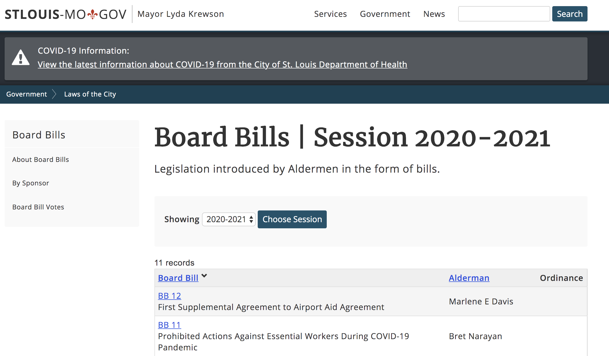

# Extracting Data from a website
---
<<<<<<< HEAD

* Last modified date: 2020.05.05

Extract diverse types of data from the web using BeautifulSoup and Pandas. The goal is to make it easier for researchers to retrieve necessary data.

1. Bill scraper
---
[stl-bill-aldermen.py]("https://github.com/minheeseo/web-scraping/blob/master/stl-bill-aldermen.py"): this script extracts bill number, session, sponsors and cosponsors of legislations introduced by STL City Aldermen. The screenshot below is the STL city website page showing a list of legislation introduced by Aldermen in the form of bills. [stl-bill-aldermen.py]("https://github.com/minheeseo/web-scraping/blob/master/stl-bill-aldermen.py") 
</img> 

2. wiki-to-table.py: convert tables from wikipedia pages into csv files
=======
 Extract diverse types of data from the web using python libraries such as BeautifulSoup and Pandas. The goal is to make it easier for researchers to retrieve necessary data.

 * stl-bill-aldermen.py: extracts bill number, session, sponsors and cosponsors of legislations introduced by STL City Aldermen
 * wiki-to-table.py: convert tables from wikipedia pages into csv files
>>>>>>> 045c28535b5e6aca44636d247816c4df31755e95
