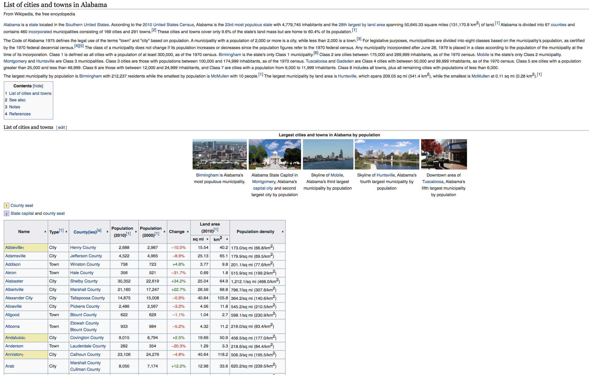

# Extracting Data from a website

* Last modified date: 2020.05.05

Extract diverse types of data from the web using BeautifulSoup and Pandas. The goal is to make it easier for researchers to retrieve necessary data.

## 1. Bill scraper
---
stl-bill-aldermen.py extracts bill number, session, sponsors and cosponsors of legislations introduced by STL City Aldermen. The screenshot below is the STL city website page showing a list of legislation introduced by Aldermen in the form of bills. 

</img> 

Appending unique ids of each aldermen and the year variable after the base URL, this script sends requests to access the detail pages of bills sponsored or co-sponsored by each aldermen by year. The results are stored as .csv file by aldermen under the data/STLbills folder.

## 2. Wikipedia Table Scraper
---
wiki-to-table.py converts tables from wikipedia pages into csv files. The screenshot below is the list of cities nested within the state of Alabama. Using pandas, the table could be extracted easily with four lines of codes.

</img> 
