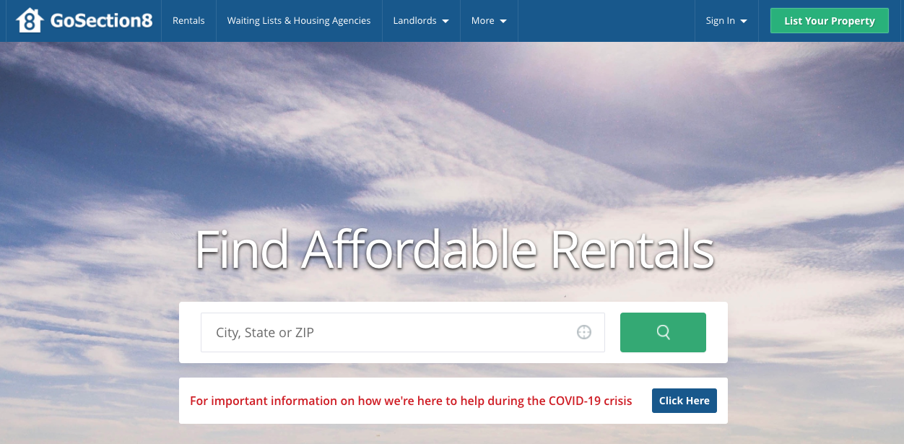
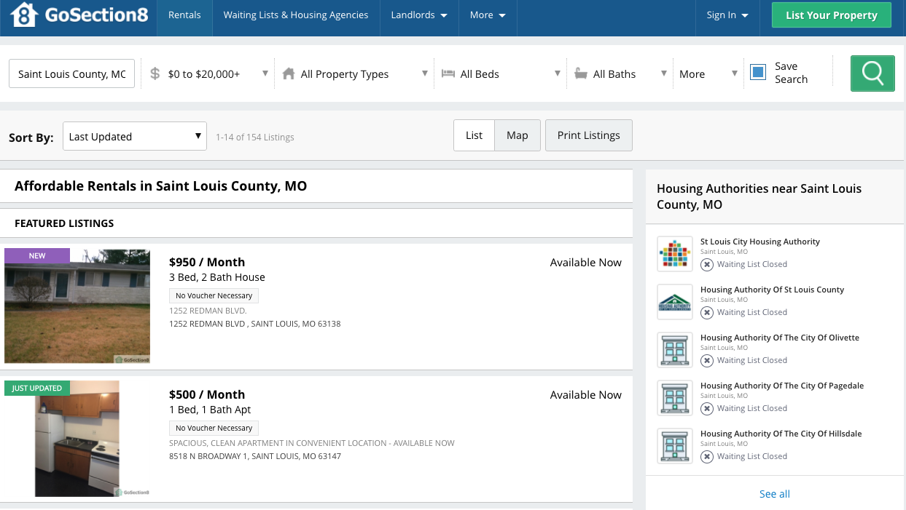
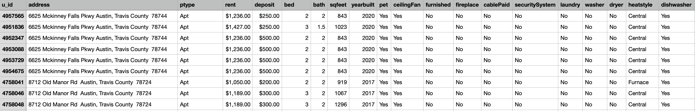
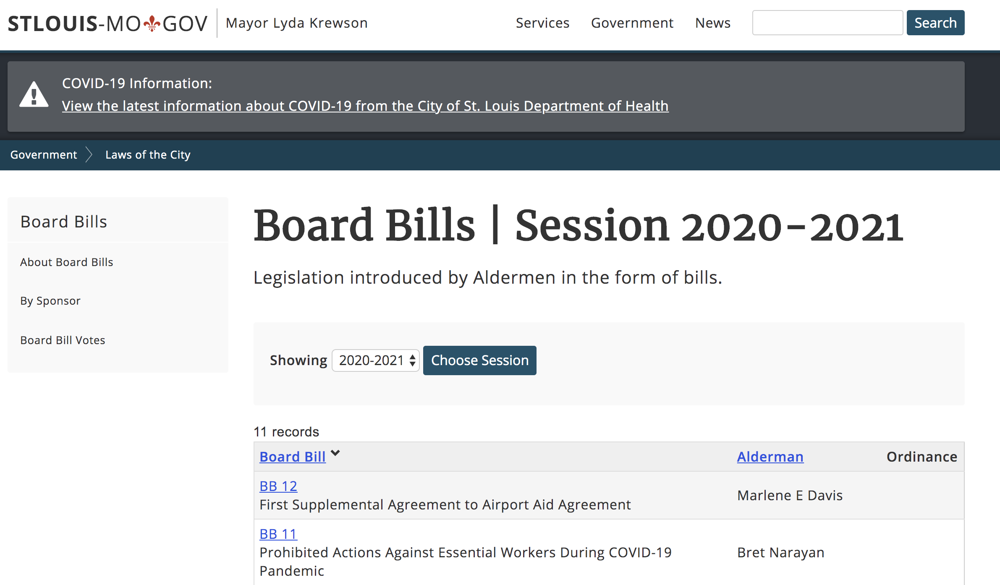
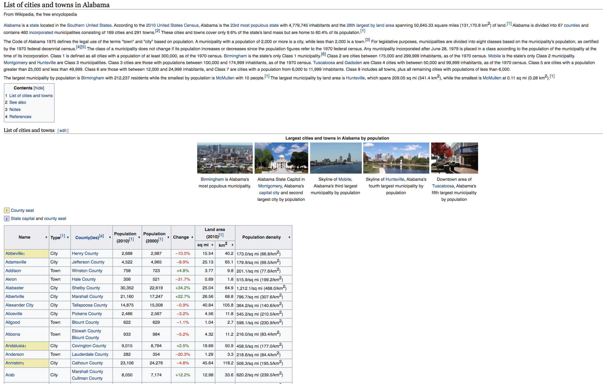

# Extracting Data from a website


* Last modified date: 2020.06.17

Extract diverse types of data from the web using Selenium, BeautifulSoup, and Pandas. The goal is to make it easier for researchers to retrieve necessary data.


## 1. Housing data scraper
---
### A. Summary
``gosection8.py`` extracts affordable rental listings from [GoSection8 website](https://www.gosection8.com/) by metropolitan areas. It uses Selenium and extracts apartment/home information, such as address, type, rental price, size, the number of bedrooms and bathrooms, and additional detailed information about features (fireplace, laundry, washer, pet, parking, swimming, smoking, and etc.), and save them as csv files.


### B. Scraping Section8 housing data
The [GoSection8 website](https://www.gosection8.com/) provides affordable property rental listings for potential Housing Choice Voucher/Section 8 tenants. The Section 8 (Housing Choice Voucher) Program allows low income tenants, the elderly, and the disabled to rent apartments and homes in the private market. For example, the screenshots below are the gosection8 website search page and the results page that shows a list of rental housings posted for St. Louis City. 


<p align="center">
</img><br/>
</img><br/>
</p>


To scrape rental listings from this website, the results of a city, state, or zip (for example, St Louis) should be first inserted in the search page. For this project, I use metropolitan area and corresponding code as inputs. Then, on the results page, each listing should be clicked for more informaion about features. Here, Selenium API is a useful tool for web scraping this website as it automates the actions. To use the code (gosection8.py), make sure you install ChromeDriver on your local machine.


### C. Code


From ``input.xlsx`` file, each metropolitan area is appended after the base URL. If there are no listings on the search results page, the scraper prints ``".....................no infomation for this link....................."``.  If there are listings, then the code checks the number of pages of the search results, automatically click on each listing, scrape information, and writes them into csv files.


```python
def get_to_the_go_rental(driver, cityname):
    url = "https://www.gosection8.com/Tenant/tn_Results.aspx?Address="
    newurl = url + cityname
    print(newurl + "  is presented..........\n")
    driver.get(newurl)
    time.sleep(np.random.lognormal(0, 1))
    soup = BeautifulSoup(driver.page_source, "lxml")
    print("waiting 5 sec for opening the website")
    time.sleep(np.random.lognormal(0, 1))
    info = soup.find("div", {"class": "noresults"})

    if info == None:

        pageLinks = []

        pageRange = soup.find("div", {"id": "MainContentPlaceHolder_paging"})
        checkChild = pageRange.find("ul", recursive=False)
        if checkChild:
            children = pageRange.find("ul", recursive=False).findAll("li")
            if len(children) > 1:
                rangeOfPage = int(children[-2].getText())
                # page starts from 0 ~ rangeofPage - 1 by adding &pg=0 ~ rangeofPage

                pageUrl = "&pg="
                for pages in range(rangeOfPage):
                    urlWithPages = newurl + pageUrl + str(pages)
                    pageLinks.append(urlWithPages)
            else:
                urlWithPages = newurl + "&pg=0"
                pageLinks.append(urlWithPages)
        else:
            urlWithPages = newurl + "&pg=0"
            pageLinks.append(urlWithPages)

        eachHouseInfo = getEachHouseHref(driver, pageLinks)
        writeIntoCVS(cityname, eachHouseInfo)

    else:
        print(".....................no infomation for this link.....................")
```


### D. Results
Screenshot of a csv file. 

<p align="center">
</img><br/>
</p>


## 2. Bill scraper
---
``stl-bill-aldermen.py`` extracts bill number, session, sponsors and cosponsors of legislations introduced by STL City Aldermen. The screenshot below is the STL city website page showing a list of legislation introduced by Aldermen in the form of bills. 

<p align="center">
</img><br/>
</p>

Appending unique ids of each aldermen and the year variable after the base URL, this script sends requests to access the detail pages of bills sponsored or co-sponsored by each aldermen by year. The results are stored as .csv file by aldermen under the data/STLbills folder.


## 3. Wikipedia Table Scraper
---
``wiki-to-table.py`` converts tables from wikipedia pages into csv files. The screenshot below is the list of cities nested within the state of Alabama. Using pandas, the table could be extracted easily with four lines of codes.

<p align="center">
</img><br/></p>